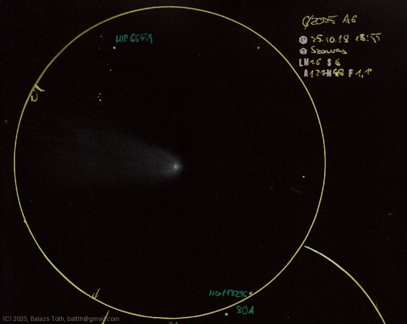

# C/2025 A6

[Main page](../index.md) -- [Index](../pages/obj_index.md)

_C/2025 A6_ -- _Comet in Solar System_  

I had really short time to observe this comet and finished the sketch
just at the end of dusk. Apart from this, this was a remarkable night,
Szarvas seems to be a really good location for observations.

Object | C/2025 A6
-|-
Observed at | Szarvas, HU, 2025-10-18 18:55
NELM | ~ 6
Seeing | 6
Aperture | 127 mm
Magnification | 48x
FOV | 1.1°

## Links

- [Full sketch](../img/c-2025-a6-theta-tau-80-tau-81-tau-20251103.jpg)
- [Original sketch](../scan/20251103003438_001.jpg)
