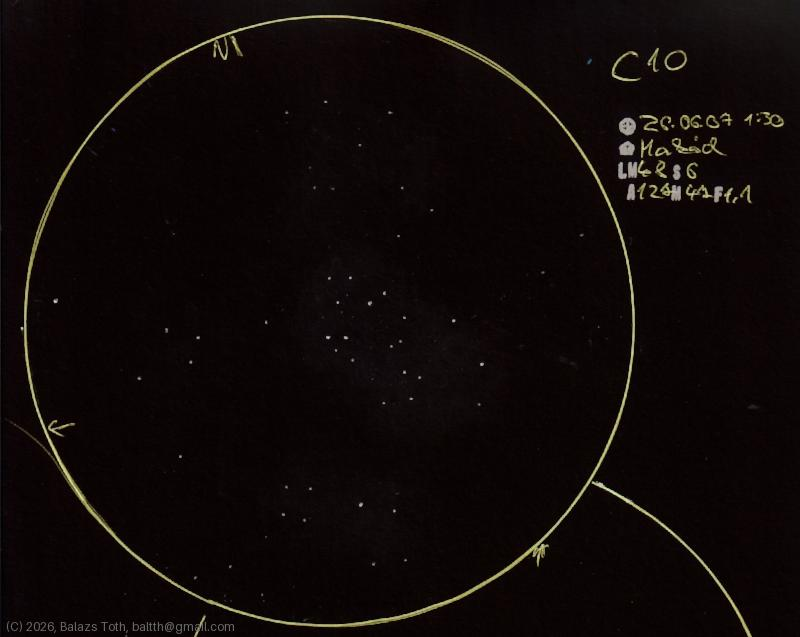

# C10

[Main page](../index.md) -- [Index](../pages/obj_index.md)

_Lawnmower Cluster_ -- _NGC 663_ -- _Open cluster in Cassiopeia_  

Made on a silent night spent with fishing, not disturbed by carps. _Rózsa-sziget_ has no open sky but
the coast of _Duna_ provides good half-sky view with low horizon and minimal light pollution.

Object | C10
-|-
Observed at | Rózsa-sziget, Makád, HU, 2026-06-07 01:30
NELM | ~ 4.8
Seeing | 6
Aperture | 127 mm
Magnification | 47x
FOV | 1.1°

#### Object data

Object | NGC 663
-|-
Desc. | Medium disperation, medium sized cluster with medium star density †
RA | 01h 46m 15s †
Dec | 61° 13' 6" †

† fetched from [astronomyapi.com](http://astronomyapi.com)

## Links

- [Full sketch](../img/c10-tau-oph-20260709.jpg)
- [Original sketch](../scan/20260709010727_001.jpg)
