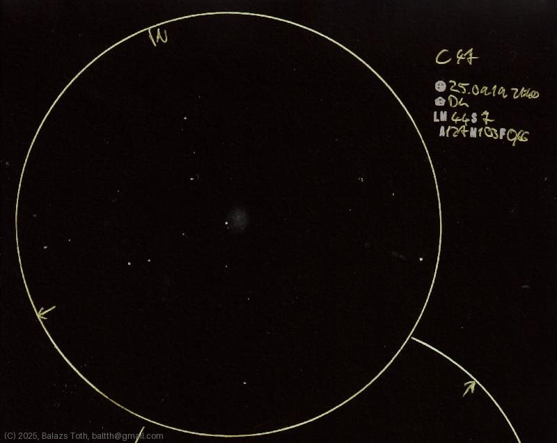

# C47

[Main page](../index.md) -- [Index](../pages/obj_index.md)

_NGC 6934_ -- _Globular cluster in Delphinus_  

Object | C47
-|-
Observed at | Dunaharaszti, HU, 2025-09-19 21:40
NELM | ~ 4.4
Seeing | 7
Aperture | 127 mm
Magnification | 103x
FOV | 0.66°

#### Object data

Object | NGC 6934
-|-
Desc. | Globular cluster
RA | 20h 34m 11s †
Dec | 7° 24' 16" †

† fetched from [astronomyapi.com](http://astronomyapi.com)

## Links

- [Full sketch](../img/c47-alpha-1-cap-alpha-2-cap-20250922.jpg)
- [Original sketch](../scan/20250922010236_001.jpg)
