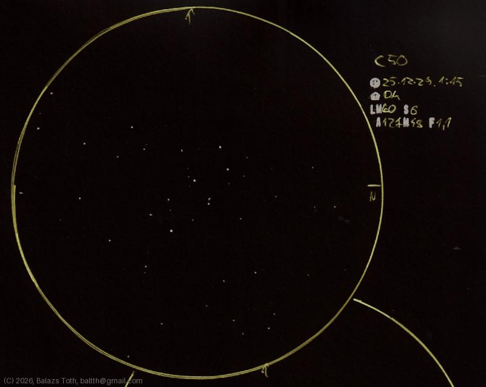

# C50

[Main page](../index.md) -- [Index](../pages/obj_index.md)

_NGC 2239_ -- _NGC 2244_ -- _In Rosette Nebula_ -- _Open cluster in Monoceros_  

Object | C50
-|-
Observed at | Dunaharaszti, HU, 2025-12-27 01:15
NELM | ~ 4.0
Seeing | 6
Aperture | 127 mm
Magnification | 48x
FOV | 1.1°

#### Object data

Object | NGC 2244
-|-
Desc. | Low disperation, large sized cluster with poor star density duplicate †
RA | 06h 31m 55s †
Dec | 4° 56' 35" †

† fetched from [astronomyapi.com](http://astronomyapi.com)

## Links

- [Full sketch](../img/c50-ngc-2264-20260130.jpg)
- [Original sketch](../scan/20260130223432_001.jpg)
