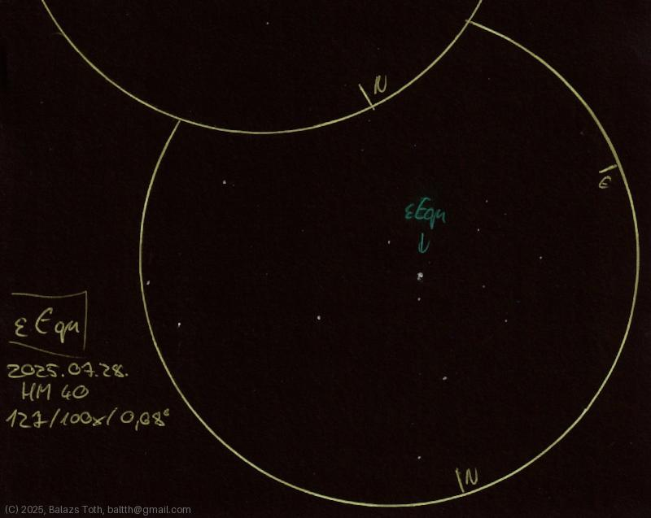

# Epsilon Equulei

[Main page](../index.md) - [Index](../pages/obj_index.md)

_Epsilon Equ_ - _ε Equ_ - _Star system in Equuleus_  

Object | Epsilon Equulei
-|-
Observed at | Dunaharaszti, HU, 2025-07-28
NELM | ~ 4.0
Aperture | 127 mm
Magnification | 100x
FOV | 0.68 °

## Links

- [Full sketch](../img/m2-epsilon-equ-20250729.jpg)
- [Original sketch](../scan/20250729.jpg)
