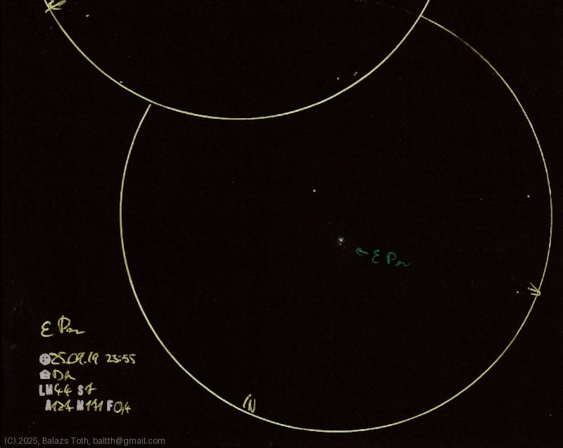

# Epsilon Persei

[Main page](../index.md) -- [Index](../pages/obj_index.md)

_Epsilon Per_ -- _ε Per_ -- _Star system in Perseus_  

Object | Epsilon Persei
-|-
Observed at | Dunaharaszti, HU, 2025-09-19 23:55
NELM | ~ 4.4
Seeing | 7
Aperture | 127 mm
Magnification | 171x
FOV | 0.4°

#### Object data

Object | Epsilon Per A
-|-
Fetched as | HD 24760
Desc. | Blue star †
RA | 03h 57m 51s †
Dec | 40° 0' 37" †
Spectral class | B0.5V †

† fetched from [astronomyapi.com](http://astronomyapi.com)

## Links

- [Full sketch](../img/eta-per-epsilon-per-20250922.jpg)
- [Original sketch](../scan/20250922010521_002.jpg)
