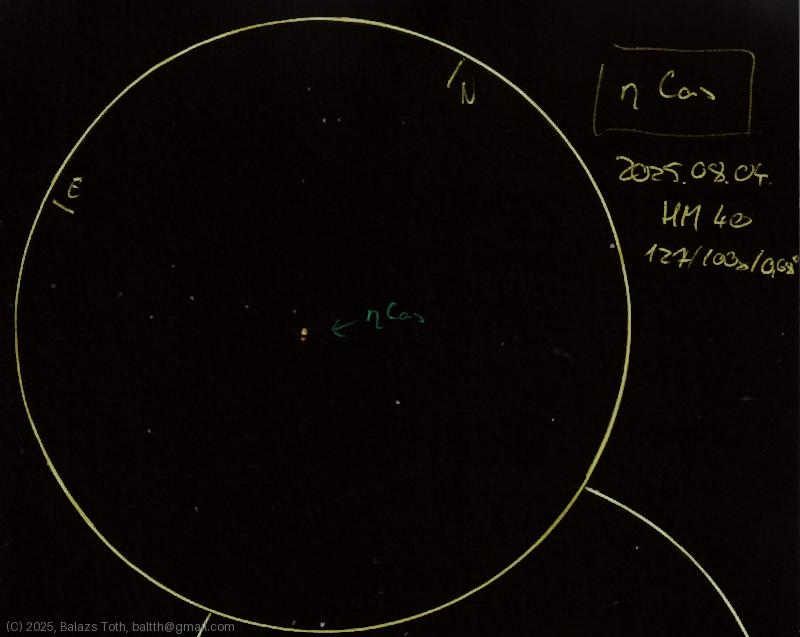

# Eta Cassiopeiae

[Main page](../index.md) - [Index](../pages/obj_index.md)

_Eta Cas_ - _η Cas_ - _Achird_ - _Double star in Cassiopeia_  

This star system is really worth to see.
Maybe the colors of the sketch are too intensive,
I was experimenting with different pencils.

Object | Eta Cassiopeiae
-|-
Observed at | Dunaharaszti, HU, 2025-08-04
NELM | ~ 4.0
Aperture | 127 mm
Magnification | 100x
FOV | 0.68 °

## Links

- [Full sketch](../img/eta-cas-70-oph-20250804.jpg)
- [Original sketch](../scan/20250804.jpg)
