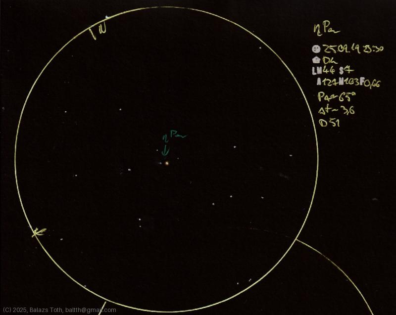

# Eta Persei

[Main page](../index.md) -- [Index](../pages/obj_index.md)

_Eta Per_ -- _η Per_ -- _ in Perseus_  

Object | Eta Persei
-|-
Observed at | Dunaharaszti, HU, 2025-09-22
FOV | 0°

## Links

- [Full sketch](../img/eta-per-epsilon-per-20250922.jpg)
- [Original sketch](../scan/20250922010521_002.jpg)
