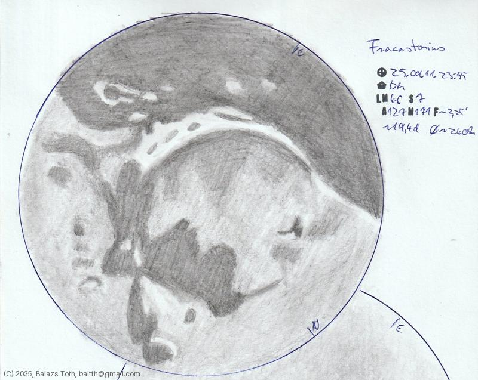

# Fracastorius

[Main page](../index.md) -- [Index](../pages/obj_index.md)

_Fracastorius_ -- _Crater in Moon_  

This crater looked really impressive. Just on the boundary of lunar night, 
full of shadows with huge contrast.
Unfortunately I couldn't represent that darkness on the sketch,
nor the sense of depth of visual observation.

Object | Fracastorius
-|-
Observed at | Dunaharaszti, HU, 2025-09-11 23:55
NELM | ~ 4.6
Seeing | 7
Aperture | 127 mm
Magnification | 171x
FOV | 2.25'
**Other data** |  
FOV diameter | ~240 km
Equivalent mag. | ~1810x
Age of Moon | 19.4 days

#### Object data

Object | Fracastorius
-|-
Desc. | Crater
Coordinates | 21.2°S 33.0°E
Size | 124 km

## Links

- [Full sketch](../img/fracastorius-aristarchus-herodotus-20250912.jpg)
- [Original sketch](../scan/20250912075516_001.jpg)
