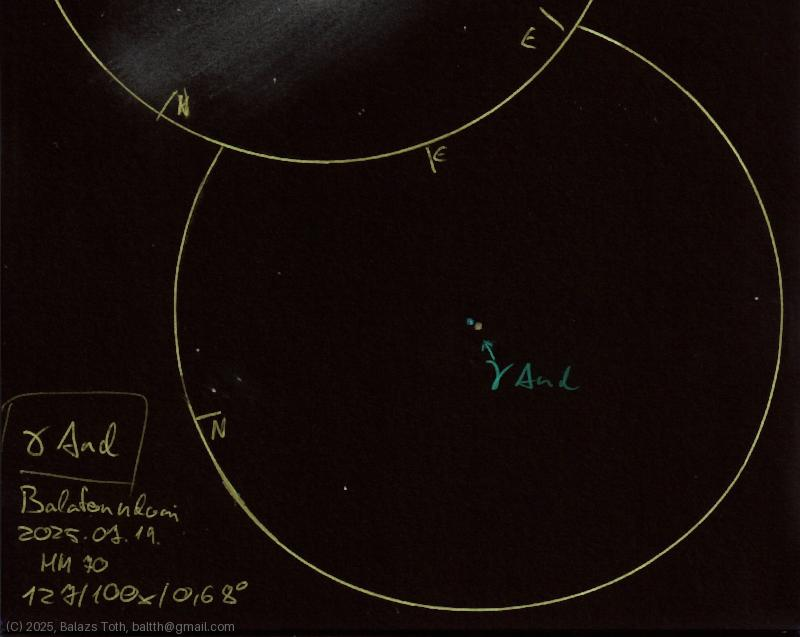

# Gamma Andromedae

[Main page](../index.md) -- [Index](../pages/obj_index.md)

_Gamma And_ -- _γ And_ -- _Star system in Andromeda_  

While it seems simple, this star system has a complex
[hierarchy](https://commons.wikimedia.org/wiki/File:Gamma_Andromedae_Components_Black.svg).
Unfortunately only the main component can be resolved separately.

Object | Gamma Andromedae
-|-
Observed at | Balatonudvari, HU, 2025-07-19
NELM | ~ 7.0
Aperture | 127 mm
Magnification | 100x
FOV | 0.68°

> While the location has nice Bortle 4.5 sky, I've created
> this sketch surrounded by street lights. These lights made
> dark adaptation extremely difficult.

#### Object data

Objects | Gamma And A | Gamma And BC
-|-|-
Fetched as | HD 12533 | HIP 9640
Desc. | Blue main sequence star † | star system
RA | 02h 03m 53s † | 
Dec | 42° 19' 47" † | 
Magnitude | 2.27 | 4.84
Spectral class | K2+IIb | B9.5V + A0V

† fetched from [astronomyapi.com](http://astronomyapi.com)

## Links

- [Full sketch](../img/m31-m32-gamma-and-20250722.jpg)
- [Original sketch](../scan/20250722004132_002.jpg)
