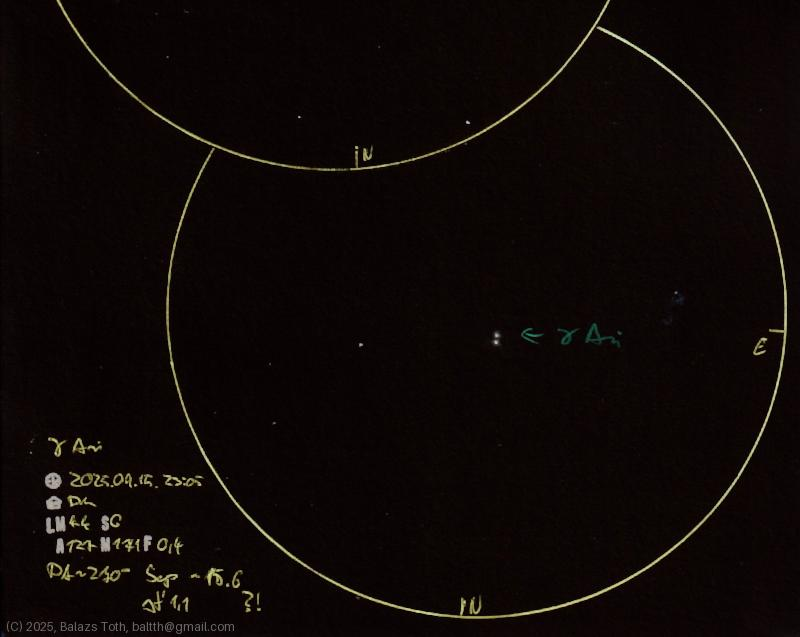

# Gamma Arietis

[Main page](../index.md) -- [Index](../pages/obj_index.md)

_Gamma Ari_ -- _γ Ari_ -- _Mesarthim_ -- _Star system in Aries_  

It's a really nice shiny blueish pair. Everything beyond
the visuals is confusing.
By [Wikipedia](https://en.wikipedia.org/wiki/Gamma_Arietis)
it's a 'binary _or possibly_ trinary star system.'
Its primary _A_ component is called _γ-2,_ while
the secondary _B_ is _γ-1._ γ-2 is considered as an
A2-class subgiant but it maybe has a red dwarf pair.
Why not?

Even the catalogue IDs are contradicting. Wikipedia states that
- A = γ-2 = HD 11503 = HR _546_ = _Mesarthim_
- B = γ-1 = HD _11502_ = HR 545

while astronomyapi.com data is
- HD _11502_ = HR _546_ = _Mesarthim_
- no data for HD 11503 nor HR 545

Spectral classes on Wikipedia:
- A: A2IVpSiSrCr
- B: A0Vnp λ Boo _or_ A0IV-V(n)kB8

On astronomyapi.com HD 11502 is A1p Si.
By the way, what is _A0IV-V(n)kB8?_ And what is
'chemically peculiar'?...

I also failed to measure the separation correctly.
The result is definitely wrong, about the double of
the real value. I have to check my method and measure
it again later.

Object | Gamma Arietis
-|-
Observed at | Dunaharaszti, HU, 2025-09-15 23:05
NELM | ~ 4.4
Seeing | 6
Aperture | 127 mm
Magnification | 171x
FOV | 0.4°
**Other data** |  
PA | ~270°
Separation | 15.6" _?!_ (catalog data: 7.6")

#### Object data

Objects | Gamma Ari A | Gamma Ari B
-|-|-
Fetched as | HD 11502 | 
Desc. | CVn type variable star | 'Lambda Boötis' star, maybe a spectroscopic binary
RA | 01h 53m 31s † | 
Dec | 19° 17' 38" † | 
Magnitude | 4.58 | 4.64
Spectral class | A1p Si † | 

† fetched from [astronomyapi.com](http://astronomyapi.com)

## Links

- [Full sketch](../img/m103-gamma-ari-20250916.jpg)
- [Original sketch](../scan/20250916011610_002.jpg)
