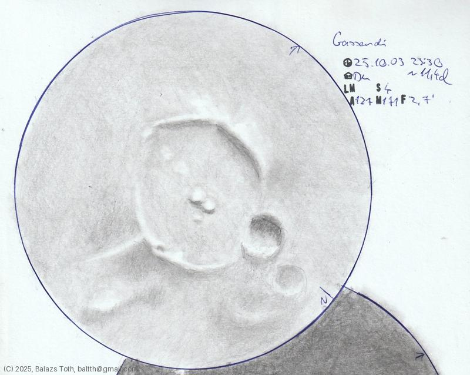

# Gassendi

[Main page](../index.md) -- [Index](../pages/obj_index.md)

_Gassendi_ -- _Crater in Moon_  

Object | Gassendi
-|-
Observed at | Dunaharaszti, HU, 2025-10-03 23:30
Seeing | 4
Aperture | 127 mm
Magnification | 171x
FOV | 2.7'
**Other data** |  
Equivalent mag. | ~1510x
Age of Moon | 11.4 days

#### Object data

Object | Gassendi
-|-
Desc. | Crater
Coordinates | 17.55°S 39.96°W
Size | 111 km

## Links

- [Full sketch](../img/gassendi-petavius-20251009.jpg)
- [Original sketch](../scan/20251009075550_001.jpg)
