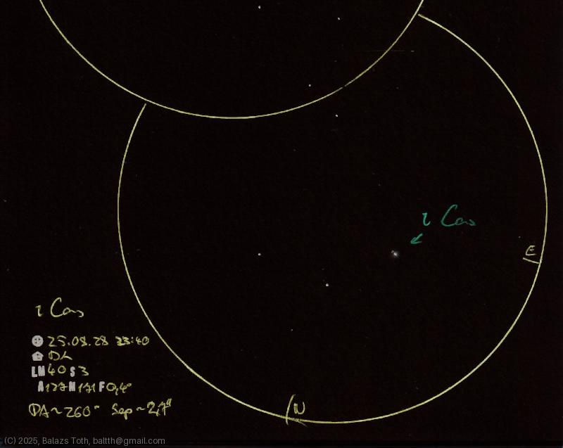

# Iota Cassiopeiae

[Main page](../index.md) - [Index](../pages/obj_index.md)

_Iota Cas_ - _ι Cas_ - _Star system in Cassiopeia_  

Object | Iota Cassiopeiae
-|-
Observed at | Dunaharaszti, HU, 2025-08-28 23:40
NELM | ~ 4.0
Seeing | 3
Aperture | 127 mm
Magnification | 171x
FOV | 0.4 °

> This night was a 'practice session' for measuring separation of double stars.
> With seeing of 3-4 and clouds coming there was no more to do.

## Links

- [Full sketch](../img/57-aql-iota-cas-20250829.jpg)
- [Original sketch](../scan/20250829153808_002.jpg)
