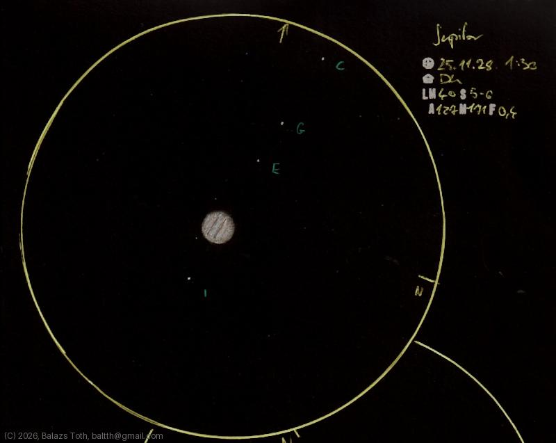

# Jupiter

[Main page](../index.md) -- [Index](../pages/obj_index.md) -- [Next: Jupiter on 2025-12-26](../obs/jupiter-2025-12-26.md)

_Jupiter_ -- _Planet in Solar System_  

My first try to sketch Jupiter with the Galilean moons.
It's a challenging task with inverted colors,
maybe the [second try](jupiter-2025-12-26) looks better.

Object | Jupiter
-|-
Observed at | Dunaharaszti, HU, 2025-11-28 01:30
NELM | ~ 4.0
Seeing | 5-6
Aperture | 127 mm
Magnification | 171x
FOV | 0.4°

## Links

- [Full sketch](../img/jupiter-jupiter-2nd-20260130.jpg)
- [Original sketch](../scan/20260130223151_001.jpg)
- [Next: Jupiter on 2025-12-26](../obs/jupiter-2025-12-26.md)
