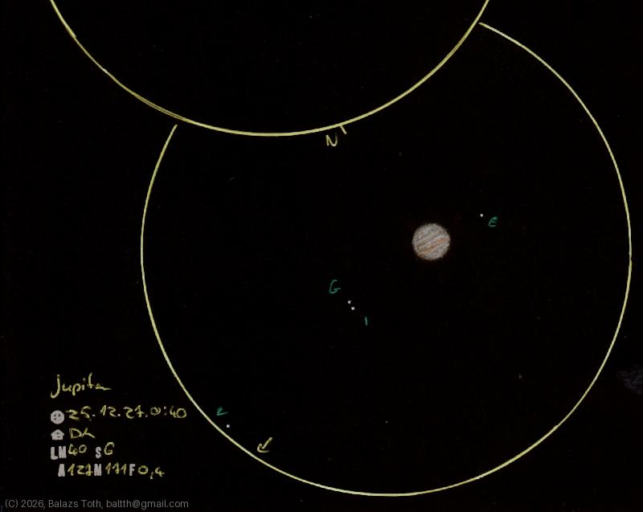

# Jupiter

[Main page](../index.md) -- [Index](../pages/obj_index.md) -- [Previous: Jupiter on 2025-11-27](../obs/jupiter-2025-11-27.md)

_Jupiter_ -- _Planet in Solar System_  

Object | Jupiter
-|-
Observed at | Dunaharaszti, HU, 2025-12-27 00:40
NELM | ~ 4.0
Seeing | 6
Aperture | 127 mm
Magnification | 171x
FOV | 0.4°

## Links

- [Full sketch](../img/jupiter-jupiter-2nd-20260130.jpg)
- [Original sketch](../scan/20260130223151_001.jpg)
- [Previous: Jupiter on 2025-11-27](../obs/jupiter-2025-11-27.md)
