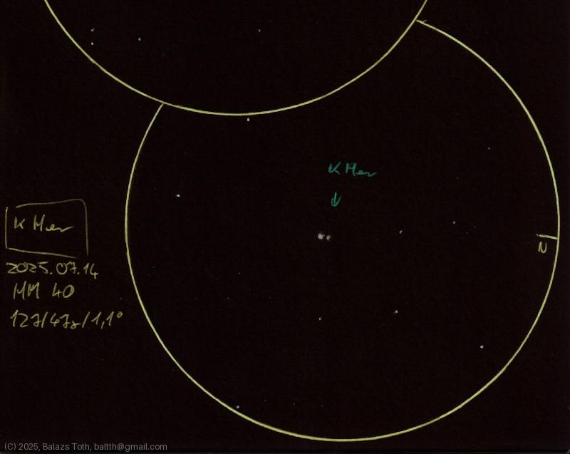

# Kappa Herculis

[Main page](../index.md) -- [Index](../pages/obj_index.md)

_Kappa Her_ -- _κ Her_ -- _Double star in Hercules_  

Object | Kappa Herculis
-|-
Observed at | Dunaharaszti, HU, 2025-07-14
NELM | ~ 4.0
Aperture | 127 mm
Magnification | 47x
FOV | 1.1°

#### Object data

Objects | Kappa Her A | Kappa Her B
-|-|-
Fetched as | HD 145001 | HD 145000
Desc. | Yellow giant star † | Giant star †
RA | 16h 08m 04s † | 16h 08m 04s †
Dec | 17° 2' 49" † | 17° 3' 16" †
Magnitude | 4.99 | 6.25
Spectral class | G8III † | K1III †

† fetched from [astronomyapi.com](http://astronomyapi.com)

## Links

- [Full sketch](../img/zeta-uma-80-uma-kappa-her-20250715.jpg)
- [Original sketch](../scan/20250715014417_002.jpg)
