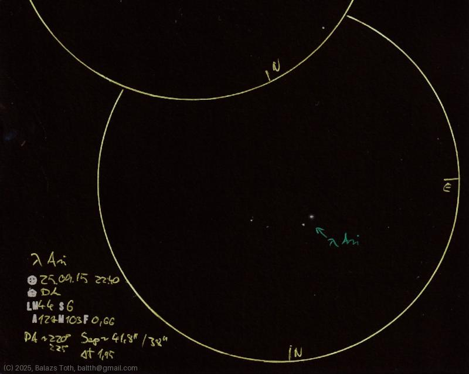

# Lambda Arietis

[Main page](../index.md) -- [Index](../pages/obj_index.md)

_Lambda Ari_ -- _Double star in Aries_  

Object | Lambda Arietis
-|-
Observed at | Dunaharaszti, HU, 2025-09-16
NELM | ~ 4.4
Seeing | 6
Aperture | 127 mm
Magnification | 103x
FOV | 0.66°
**Other data** |  
PA | ~220° -- 225°
Separation | 38" -- 41.8"

#### Object data

Objects | Lambda Ari A | Lambda Ari B
-|-|-
Fetched as | HD 11973 | ~B
Desc. | Main sequence star | Main sequence star
RA | 01h 57m 55s † | 
Dec | 23° 35' 46" † | 
Magnitude | 4.95 | 7.75
Spectral class | F0V † | G1V

† fetched from [astronomyapi.com](http://astronomyapi.com)

## Links

- [Full sketch](../img/saturn-lambda-ari-20250916.jpg)
- [Original sketch](../scan/20250916011030_001.jpg)
