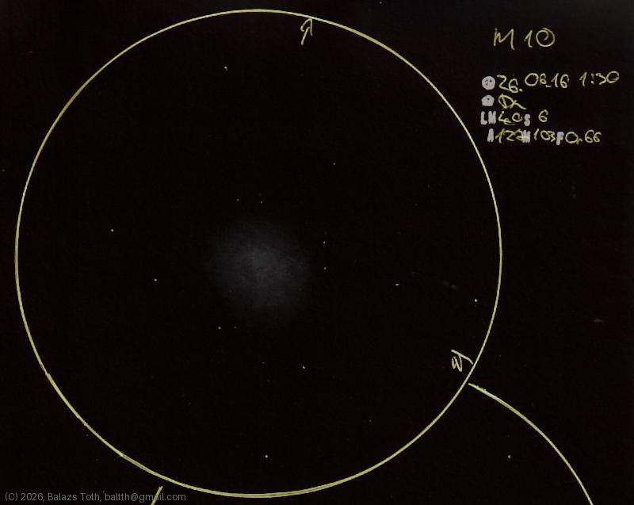

# Messier 10

[Main page](../index.md) -- [Index](../pages/obj_index.md)

_M10_ -- _NGC 6254_ -- _Globular cluster in Ophiuchus_  

I usually struggle observing M10 and [M12](m12-2026-06-15.md) from the suburban sky of my hometown -
somehow they're hard to locate and not spectacular. This night was different.

M10 is not bright but big - at least it seemed to be - and has a nice circular shape.
It seemed a bit textured but I was not able to resolve stars or locate irregularities.

Object | Messier 10
-|-
Observed at | Dunaharaszti, HU, 2026-06-16 01:30
NELM | ~ 4.0
Seeing | 6
Aperture | 127 mm
Magnification | 103x
FOV | 0.66°

#### Object data

Object | M 10
-|-
Desc. | Intermediate loose concentration globular cluster †
RA | 16h 57m 00s †
Dec | -4° 6' 0" †

† fetched from [astronomyapi.com](http://astronomyapi.com)

## Links

- [Full sketch](../img/m10-m12-20260709.jpg)
- [Original sketch](../scan/20260709010839_001.jpg)
