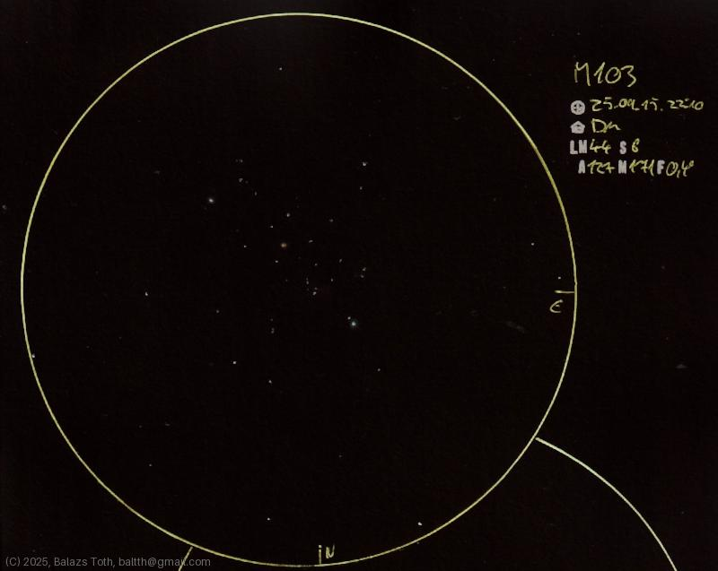

# Messier 103

[Main page](../index.md) -- [Index](../pages/obj_index.md)

_M103_ -- _NGC 581_ -- _Open cluster in Cassiopeia_  

Object | Messier 103
-|-
Observed at | Dunaharaszti, HU, 2025-09-15 22:10
NELM | ~ 4.4
Seeing | 6
Aperture | 127 mm
Magnification | 171x
FOV | 0.4°

#### Object data

Object | M 103
-|-
Desc. | Medium disperation, medium sized cluster with poor star density †
RA | 01h 33m 00s †
Dec | 60° 42' 0" †

† fetched from [astronomyapi.com](http://astronomyapi.com)

## Links

- [Full sketch](../img/m103-gamma-ari-20250916.jpg)
- [Original sketch](../scan/20250916011610_002.jpg)
