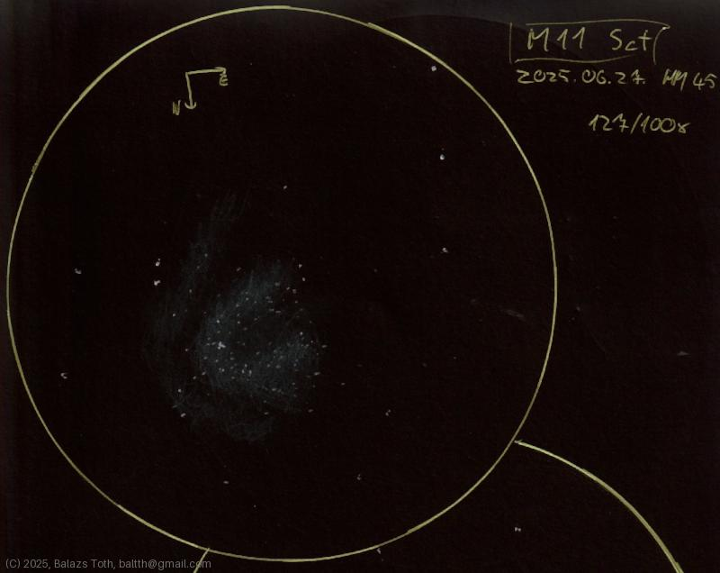

# Messier 11

[Main page](../index.md) - [Index](../pages/obj_index.md)

_M11_ - _NGC 6705_ - _Wild Duck Cluster_ - _Open cluster in Scutum_  

A favorite since the first view.

This was the first sketch using the 'double circle' format
on a B5 notepad. It looked so fascinating that I've done
two sketches with different magnification, check
the link below.

Object | Messier 11
-|-
Observed at | Dunaharaszti, HU, 2025-06-27
NELM | ~ 4.5
Aperture | 127 mm
Magnification | 100x
FOV | 0.68°

## Links

- [Full sketch](../img/m11-m11-2nd-20250628.jpg)
- [Original sketch](../scan/20250628_1.jpg)
