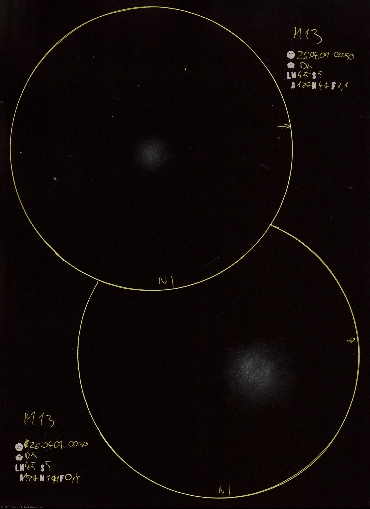

# Messier 13

[Main page](../index.md) -- [Index](../pages/obj_index.md)

_M13_ -- _NGC 6205_ -- _Hercules Cluster_ -- _Globular cluster in Hercules_  

Object | Messier 13
-|-
Observed at | Dunaharaszti, HU, 2026-04-09 00:50
NELM | ~ 4.5
Seeing | 5
Aperture | 127 mm
Magnification | 171x
FOV | 0.4°

#### Object data

Object | M 13
-|-
Desc. | Intermediate concentrations globular cluster †
RA | 16h 41m 24s †
Dec | 36° 27' 36" †

† fetched from [astronomyapi.com](http://astronomyapi.com)

## Links

- [Full sketch](../img/m13-m13-2nd-20260410.jpg)
- [Original sketch](../scan/20260410171115_001.jpg)
