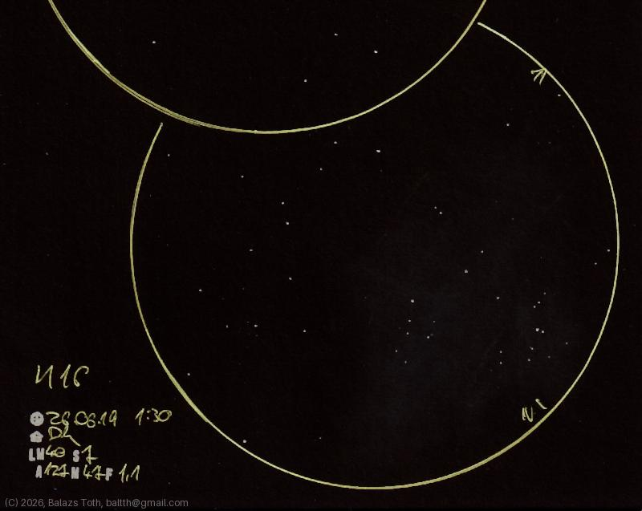

# Messier 16

[Main page](../index.md) -- [Index](../pages/obj_index.md)

_M16_ -- _NGC 6611_ -- _LBN 67_ -- _Eagle Nebula_ -- _Open cluster in Serpens_  

Well, this may not meet your expectations. It's sad but this is how this beautiful nebula
looks like on a suburban sky. At least it's OK as an open cluster.
I'm looking forward to observe it under good skies.

Object | Messier 16
-|-
Observed at | Dunaharaszti, HU, 2026-06-19 01:30
NELM | ~ 40
Seeing | 7
Aperture | 127 mm
Magnification | 47x
FOV | 1.1°

#### Object data

Object | M 16
-|-
Desc. | Low disperation, large sized cluster with medium star density †
RA | 18h 18m 36s †
Dec | -13° 49' 12" †

† fetched from [astronomyapi.com](http://astronomyapi.com)

## Links

- [Full sketch](../img/m14-m16-20260709.jpg)
- [Original sketch](../scan/20260709010949_001.jpg)
