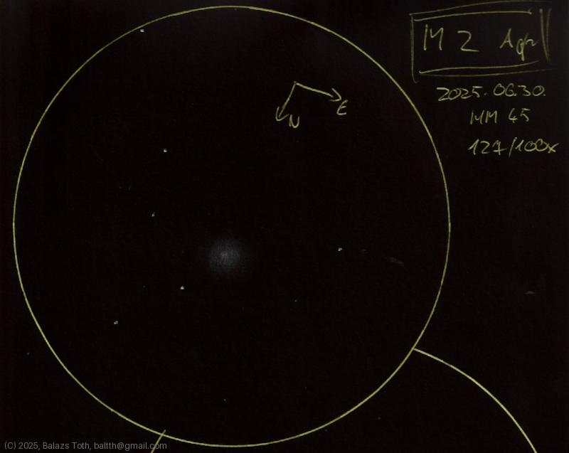

# Messier 2

[Main page](../index.md) -- [Index](../pages/obj_index.md) -- [Next: Messier 2 on 2025-07-28](../obs/m2-2025-07-28.md)

_M2_ -- _NGC 7089_ -- _Globular cluster in Aquarius_  

Object | Messier 2
-|-
Observed at | Dunaharaszti, HU, 2025-06-30
NELM | ~ 4.5
Aperture | 127 mm
Magnification | 100x
FOV | 0.68°

## Links

- [Full sketch](../img/m2-ngc7009-20250701.jpg)
- [Original sketch](../scan/20250701_1.jpg)
- [Next: Messier 2 on 2025-07-28](../obs/m2-2025-07-28.md)
