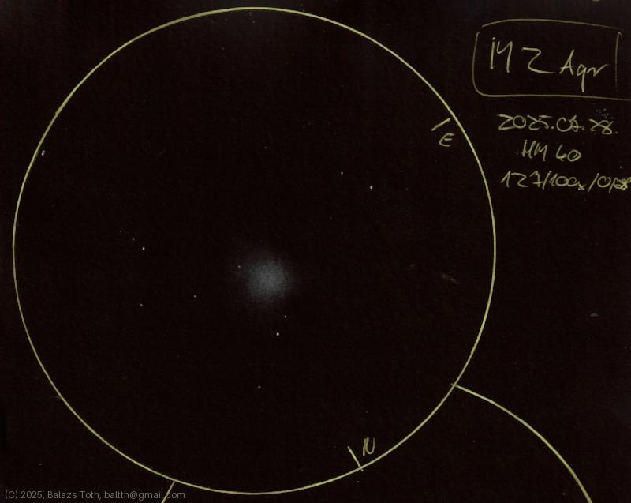

# Messier 2

[Main page](../index.md) -- [Index](../pages/obj_index.md) -- [Previous: Messier 2 on 2025-06-30](../obs/m2-2025-06-30.md)

_M2_ -- _NGC 7089_ -- _Globular cluster in Aquarius_  

This is my second sketch of M2, definitely better than the first one.

Object | Messier 2
-|-
Observed at | Dunaharaszti, HU, 2025-07-28
NELM | ~ 4.0
Aperture | 127 mm
Magnification | 100x
FOV | 0.68°

## Links

- [Full sketch](../img/m2-epsilon-equ-20250729.jpg)
- [Original sketch](../scan/20250729.jpg)
- [Previous: Messier 2 on 2025-06-30](../obs/m2-2025-06-30.md)
