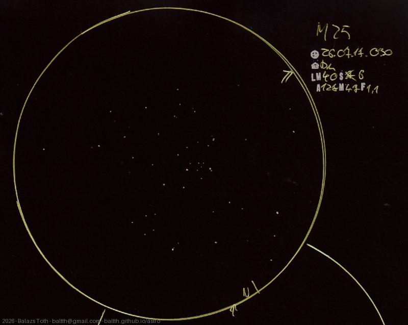

# Messier 25

[Main page](../index.md) -- [Index](../pages/obj_index.md)

_M25_ -- _IC 4725_ -- _Open cluster in Sagittarius_  

I really enjoy drawing open clusters like this. It's challenging but but the result is visually correct
and spectacular at the same time - at least if one likes 'white dots on black'.

Object | Messier 25
-|-
Observed at | Dunaharaszti, HU, 2026-07-17 00:30
NELM | ~ 4.0
Seeing | 6
Aperture | 127 mm
Magnification | 47x
FOV | 1.1°

#### Object data

Object | M 25
-|-
Desc. | Open cluster †
RA | 18h 31m 12s †
Dec | -19° 15' 0" †

† fetched from [astronomyapi.com](http://astronomyapi.com)

## Links

- [Full sketch](../img/m25-11-aql-20260804.jpg)
- [Original sketch](../scan/20260804000152_001.jpg)
