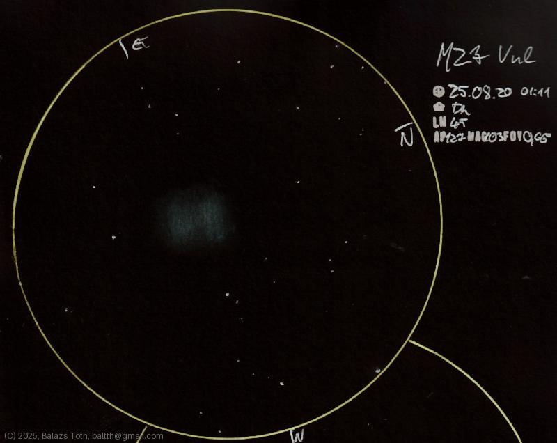

# Messier 27

[Main page](../index.md) -- [Index](../pages/obj_index.md)

_M27_ -- _NGC 6853_ -- _Dumbbell Nebula_ -- _Planetary nebula in Vulpecula_  

Dumbbell Nebula is a favorite -
this was my first deep space object,
observed about eight years ago.
This night it looked really well,
just as bright to perfectly show its contour.
Sometimes it has a shape like a brick but not today.

Object | Messier 27
-|-
Observed at | Dunaharaszti, HU, 2025-08-20 01:11
NELM | ~ 4.5
Aperture | 127 mm
Magnification | 103x
FOV | 0.66°

> This night was exceptionally clear, NELM was rather 4.7.
> I was experimenting with using black and blue pens for annotations.

#### Object data

Object | M 27
-|-
Desc. | Planetary nebula †
RA | 19h 59m 24s †
Dec | 22° 43' 12" †

† fetched from [astronomyapi.com](http://astronomyapi.com)

## Links

- [Full sketch](../img/m27-61-cyg-20250820.jpg)
- [Original sketch](../scan/20250820_2.jpg)
