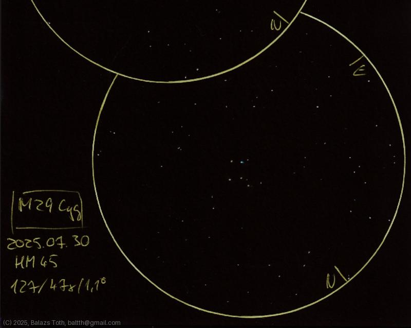

# Messier 29

[Main page](../index.md) - [Index](../pages/obj_index.md)

_M29_ - _NGC 6913_ - _Cooling Tower Cluster_ - _Open cluster in Cygnus_  

Object | Messier 29
-|-
Observed at | Dunaharaszti, HU, 2025-07-30
NELM | ~ 4.5
Aperture | 127 mm
Magnification | 47x
FOV | 1.1°

## Links

- [Full sketch](../img/m39-m29-20250731.jpg)
- [Original sketch](../scan/20250731.jpg)
