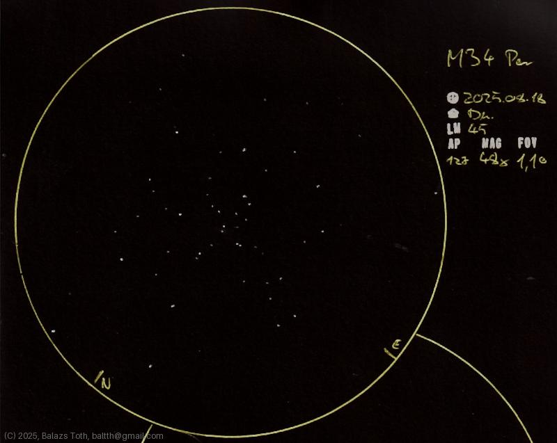

# Messier 34

[Main page](../index.md) -- [Index](../pages/obj_index.md)

_M34_ -- _NGC 1039_ -- _Spiral Cluster_ -- _Open cluster in Perseus_  

Object | Messier 34
-|-
Observed at | Dunaharaszti, HU, 2025-08-18
NELM | ~ 4.5
Aperture | 127 mm
Magnification | 48x
FOV | 1.1°

#### Object data

Object | M 34
-|-
Desc. | Low disperation, large sized cluster with medium star density †
RA | 02h 42m 00s †
Dec | 42° 46' 12" †

† fetched from [astronomyapi.com](http://astronomyapi.com)

## Links

- [Full sketch](../img/m34-alpha-umi-20250820.jpg)
- [Original sketch](../scan/20250819005451_001.jpg)
