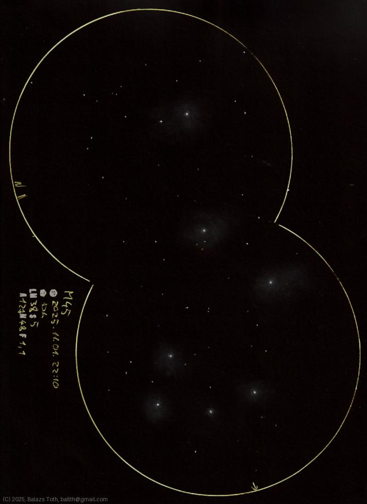

# Messier 45

[Main page](../index.md) -- [Index](../pages/obj_index.md)

_M45_ -- _Pleiades_ -- _Open cluster in Taurus_  

Something new... the first double-stack sketch. As 1.1° is my
largest FOV, Pleiades fits perfectly into the overlapping circles.
I've created this as an experiment, but the result is pretty.
I'm sure I'll repeat this under good skies.

Object | Messier 45
-|-
Observed at | Dunaharaszti, HU, 2025-11-01 22:10
NELM | ~ 3.8
Seeing | 5
Aperture | 127 mm
Magnification | 48x
FOV | 1.1°

#### Object data

Object | M 45
-|-
Desc. | Open cluster †
RA | 03h 47m 24s †
Dec | 24° 7' 12" †

† fetched from [astronomyapi.com](http://astronomyapi.com)

## Links

- [Full sketch](../img/m45-na-20251103.jpg)
- [Original sketch](../scan/20251103003906_001.jpg)
