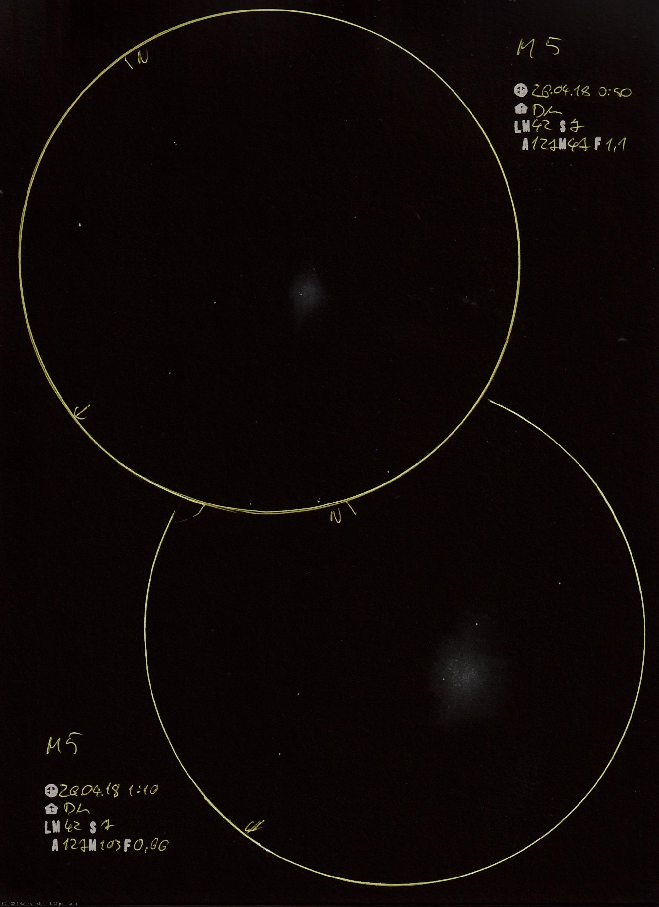

# Messier 5

[Main page](../index.md) -- [Index](../pages/obj_index.md)

_M5_ -- _NGC 5904_ -- _Rose Cluster_ -- _Globular cluster in Serpens_  

Double sketch of this spectacular cluster. For me it looked a bit asymmetric, and
the shiny center had oval surroundings.

Object | Messier 5
-|-
Observed at | Dunaharaszti, HU, 2026-04-18 00:50
NELM | ~ 4.2
Seeing | 7
Aperture | 127 mm
Magnification | 171x
FOV | 0.4°

#### Object data

Object | M 5
-|-
Desc. | Intermediate concentrations globular cluster †
RA | 15h 18m 36s †
Dec | 2° 4' 48" †

† fetched from [astronomyapi.com](http://astronomyapi.com)

## Links

- [Full sketch](../img/m5-m5-2nd-20260420.jpg)
- [Original sketch](../scan/20260420213532_001.jpg)
