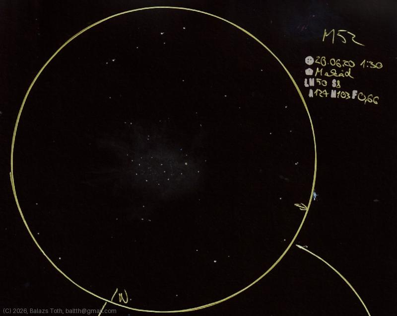

# Messier 52

[Main page](../index.md) -- [Index](../pages/obj_index.md)

_M52_ -- _Scorpion Cluster_ -- _NGC 7654_ -- _Open cluster in Cassiopeia_  

An interestingly asymmetric cluster with some 'tentacles' on the west.

Object | Messier 52
-|-
Observed at | Rózsa-sziget, Makád, HU, 2026-06-20 01:30
NELM | ~ 50
Seeing | 8
Aperture | 127 mm
Magnification | 103x
FOV | 0.66°

#### Object data

Object | M 52
-|-
Desc. | Very low disperation, medium sized cluster with rich star density †
RA | 23h 24m 00s †
Dec | 61° 34' 48" †

† fetched from [astronomyapi.com](http://astronomyapi.com)

## Links

- [Full sketch](../img/m52-m110-20260709.jpg)
- [Original sketch](../scan/20260709011046_001.jpg)
