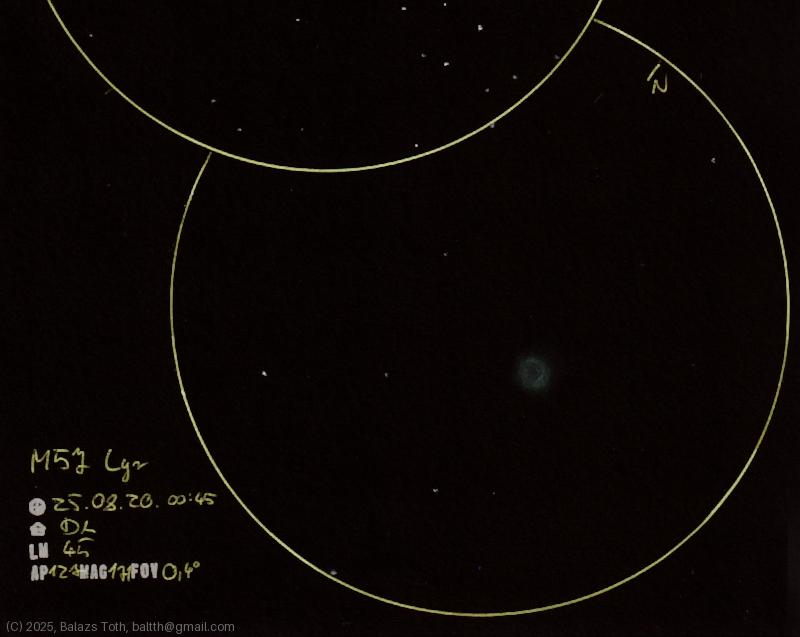

# Messier 57

[Main page](../index.md) -- [Index](../pages/obj_index.md)

_M57_ -- _NGC 6720_ -- _Ring Nebula_ -- _Planetary nebula in Lyra_  

The Ring could be seen really well today.
It was really hard to determine the orientation
of its elliptic shape, just as if it were swapping
directions based on my view.

Object | Messier 57
-|-
Observed at | Dunaharaszti, HU, 2025-08-20 00:45
NELM | ~ 4.0
Aperture | 127 mm
Magnification | 171x
FOV | 0.4°

> This night was exceptionally clear, NELM was rather 4.7.
> I was experimenting with using black and blue pens for annotations
> and mixed up in the end.

#### Object data

Object | M 57
-|-
Desc. | Planetary nebula †
RA | 18h 53m 24s †
Dec | 33° 1' 48" †

† fetched from [astronomyapi.com](http://astronomyapi.com)

## Links

- [Full sketch](../img/ngc-6633-m57-20250820.jpg)
- [Original sketch](../scan/20250820105022_001.jpg)
