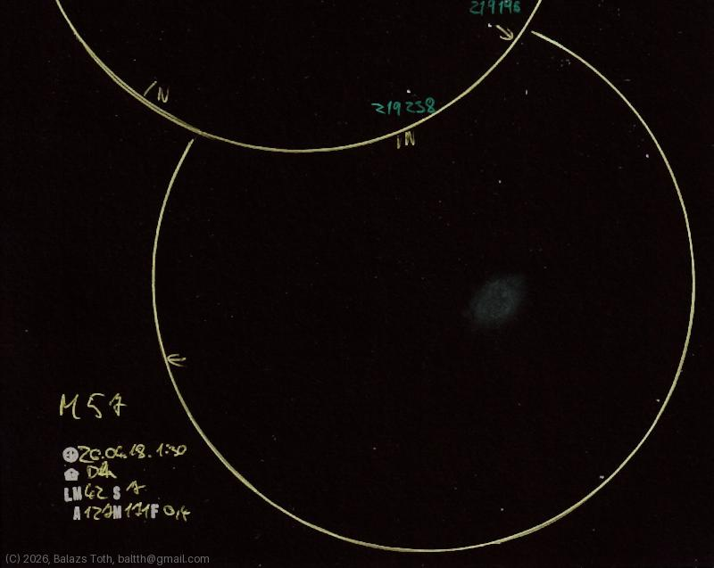

# Messier 57

[Main page](../index.md) -- [Index](../pages/obj_index.md) -- [Previous: Messier 57 on 2025-08-19](../obs/m57-2025-08-19.md)

_M57_ -- _NGC 6720_ -- _Ring Nebula_ -- _Planetary nebula in Lyra_  

Object | Messier 57
-|-
Observed at | Dunaharaszti, HU, 2026-04-18 01:30
NELM | ~ 4.2
Seeing | 7
Aperture | 127 mm
Magnification | 171x
FOV | 0.4°

#### Object data

Object | M 57
-|-
Desc. | Planetary nebula †
RA | 18h 53m 24s †
Dec | 33° 1' 48" †

† fetched from [astronomyapi.com](http://astronomyapi.com)

## Links

- [Full sketch](../img/c-2025-r3-m57-20260420.jpg)
- [Original sketch](../scan/20260420213347_001.jpg)
- [Previous: Messier 57 on 2025-08-19](../obs/m57-2025-08-19.md)
