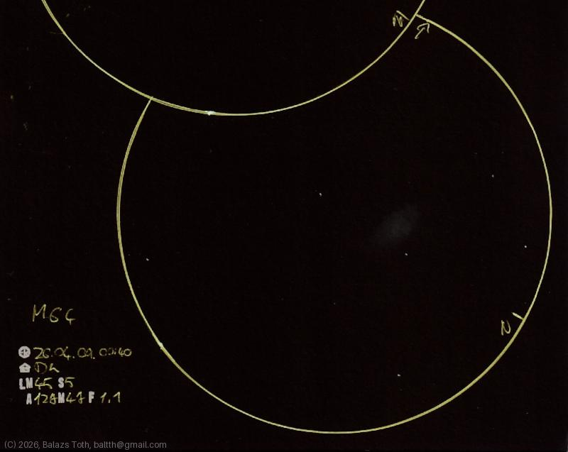

# Messier 64

[Main page](../index.md) -- [Index](../pages/obj_index.md)

_M64_ -- _NGC 4826_ -- _Black Eye Galaxy_ -- _Galaxy in Coma Berenices_  

Object | Messier 64
-|-
Observed at | Dunaharaszti, HU, 2026-04-09 00:40
NELM | ~ 4.5
Seeing | 5
Aperture | 127 mm
Magnification | 47x
FOV | 1.1°

#### Object data

Object | M 64
-|-
Desc. | Spiral galaxy †
RA | 12h 57m 00s †
Dec | 21° 40' 48" †

† fetched from [astronomyapi.com](http://astronomyapi.com)

## Links

- [Full sketch](../img/m53-m64-20260410.jpg)
- [Original sketch](../scan/20260410170920_001.jpg)
