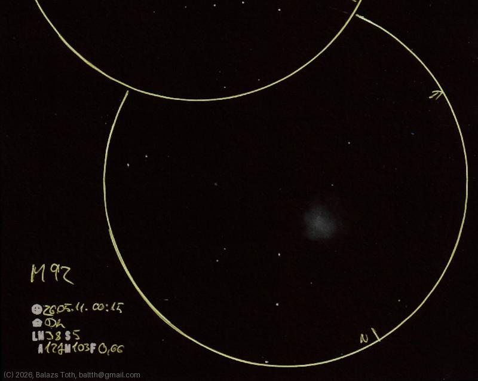

# Messier 92

[Main page](../index.md) -- [Index](../pages/obj_index.md)

_M92_ -- _Globular cluster in Hercules_  

Object | Messier 92
-|-
Observed at | Dunaharaszti, HU, 2026-05-11 00:15
NELM | ~ 3.8
Seeing | 5
Aperture | 127 mm
Magnification | 103x
FOV | 0.66°

#### Object data

Object | M 92
-|-
Desc. | Intermediate rich concentrations globular cluster †
RA | 17h 17m 24s †
Dec | 43° 8' 24" †

† fetched from [astronomyapi.com](http://astronomyapi.com)

## Links

- [Full sketch](../img/m48-m92-20260601.jpg)
- [Original sketch](../scan/20260601011330_001.jpg)
