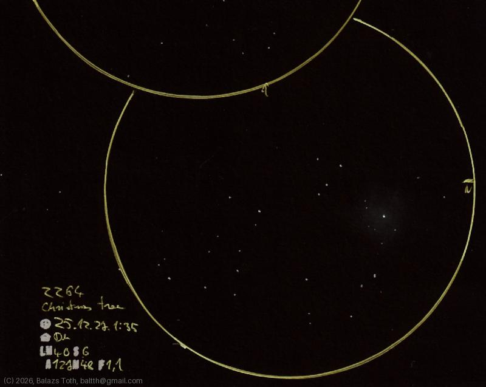

# NGC 2264

[Main page](../index.md) -- [Index](../pages/obj_index.md)

_LBN 911_ -- _Christmas Tree Cluster_ -- _Open cluster in Monoceros_  

Sketched on the second night of Christmas. I've chosen this unintentionally
and realized that it's the Christmas Tree just after I've finished the sketch.

Object | NGC 2264
-|-
Observed at | Dunaharaszti, HU, 2025-12-27 01:35
NELM | ~ 4.0
Seeing | 6
Aperture | 127 mm
Magnification | 48x
FOV | 1.1°

#### Object data

Object | NGC 2264
-|-
Desc. | High disperation, large sized cluster with poor star density †
RA | 06h 40m 58s †
Dec | 9° 53' 44" †

† fetched from [astronomyapi.com](http://astronomyapi.com)

## Links

- [Full sketch](../img/c50-ngc-2264-20260130.jpg)
- [Original sketch](../scan/20260130223432_001.jpg)
