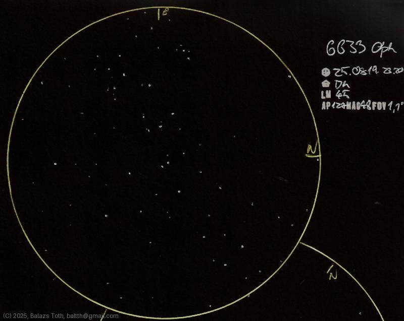

# NGC 6633

[Main page](../index.md) - [Index](../pages/obj_index.md)

_NGC 6633_ - _Open cluster in Ophiuchus_  

This sketch was a challenge.
I've tried to interpret the proper relative brightness
of the stars but the result lacks the real shine of
the main ones.

Object | NGC 6633
-|-
Observed at | Dunaharaszti, HU, 2025-08-19 23:20
NELM | ~ 4.5
Aperture | 127 mm
Magnification | 48x
FOV | 1.1°

> This night was exceptionally clear, NELM was rather 4.7.
> I was experimenting with using black and blue pens for annotations
> and mixed up in the end.

#### Object data

Object | NGC 6633
-|-
Desc. | Medium disperation, medium sized cluster with medium star density †
RA | 18h 27m 15s †
Dec | 6° 30' 30" †

† fetched from [astronomyapi.com](http://astronomyapi.com)

## Links

- [Full sketch](../img/ngc-6633-m57-20250820.jpg)
- [Original sketch](../scan/20250820_1.jpg)
