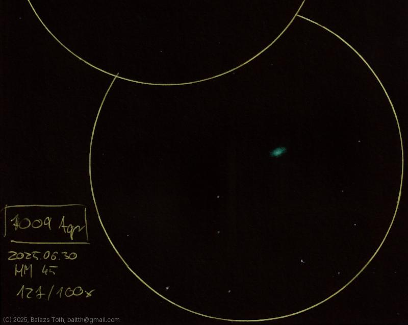

# NGC 7009

[Main page](../index.md) - [Index](../pages/obj_index.md)

_Caldwell 55_ - _Saturn Nebula_ - _Planetary nebula in Aquarius_  

Saturn Nebula looked extremely well on this night.
The color and intensity of the sketch is exaggerated.
Maybe this shows my impression of this beautiful nebula,
or simply caused by my lack of experience.

Object | NGC 7009
-|-
Observed at | Dunaharaszti, HU, 2025-06-30
NELM | ~ 4.5
Aperture | 127 mm
Magnification | 100x
FOV | 0.68 °

## Links

- [Full sketch](../img/m2-ngc7009-20250701.jpg)
- [Original sketch](../scan/20250701_1.jpg)
