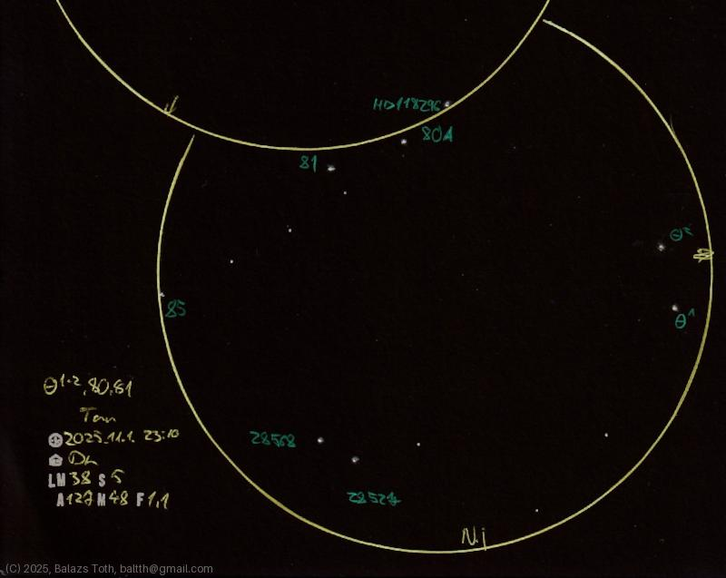
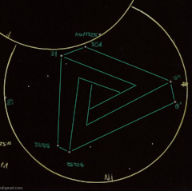

# Penrose triangle

[Main page](../index.md) -- [Index](../pages/obj_index.md)

_Penrose triangle_ -- _Asterism in Taurus_  

These stars are part of the Hyades, forming an asterism like a
[Penrose triangle](https://en.wikipedia.org/wiki/Penrose_triangle).
Unfortunately the FOV is a bit small, visually it's more spectacular
and the group is easy to identify.

I've found no reference about this 'asterism' yet, so I named it
by my first association:

Members of the group:
- Theta-1 Tau (4.0 mag)
- Theta-2 Tau (3.5 mag)
- 80 Tau (5.6 mag)
- 81 Tau (5.5 mag)
- HD 28568 (6.6 mag)
- HD 28527 (4.8 mag)

Object | Penrose triangle
-|-
Observed at | Dunaharaszti, HU, 2025-11-01 23:10
NELM | ~ 3.8
Seeing | 5
Aperture | 127 mm
Magnification | 48x
FOV | 1.1°

## Links

- [Full sketch](../img/c-2025-a6-penrose-triangle-20251103.jpg)
- [Original sketch](../scan/20251103003438_001.jpg)
