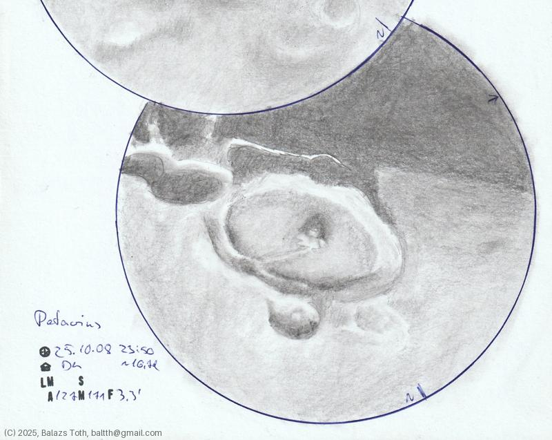

# Petavius

[Main page](../index.md) -- [Index](../pages/obj_index.md)

_Petavius_ -- _Crater in Moon_  

I've done this sketch as an experiment on a cloudy night.
The sky was covered by a thin but even layer of cirrocumulus,
I was able to observe details only for a few minutes.
It was fun in the end and the result is not so bad.

Object | Petavius
-|-
Observed at | Dunaharaszti, HU, 2025-10-08 23:50
Seeing | cloudy...
Aperture | 127 mm
Magnification | 171x
FOV | 3.3'
**Other data** |  
Equivalent mag. | ~1236x
Age of Moon | 16.7 days

#### Object data

Object | Petavius
-|-
Desc. | Crater
Coordinates | 23.2°N 49.7°W
Size | 177 km

## Links

- [Full sketch](../img/gassendi-petavius-20251009.jpg)
- [Original sketch](../scan/20251009075550_001.jpg)
