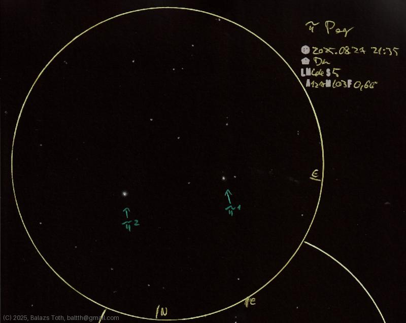

# Pi-1 Pegasi, Pi-2 Pegasi

[Main page](../index.md) -- [Index](../pages/obj_index.md)

_Pi-1 Peg_ -- _Astrometric binary star in Pegasus_  
_Pi-2 Peg_ -- _Star in Pegasus_  

Pi-1 and Pi-2 Pegasi are unrelated and too far (10') to
be called binary. While Pi-1 is a binary on its own,
its pair is not visible, however the surrounding faint stars
were associated with it formerly.

Objects | Pi-1 Pegasi, Pi-2 Pegasi
-|-
Observed at | Dunaharaszti, HU, 2025-08-27 21:35
NELM | ~ 4.4
Seeing | 5
Aperture | 127 mm
Magnification | 103x
FOV | 0.66°

## Links

- [Full sketch](../img/pi-1-peg-pi-2-peg-15-aql-20250828.jpg)
- [Original sketch](../scan/20250828010814_001.jpg)
