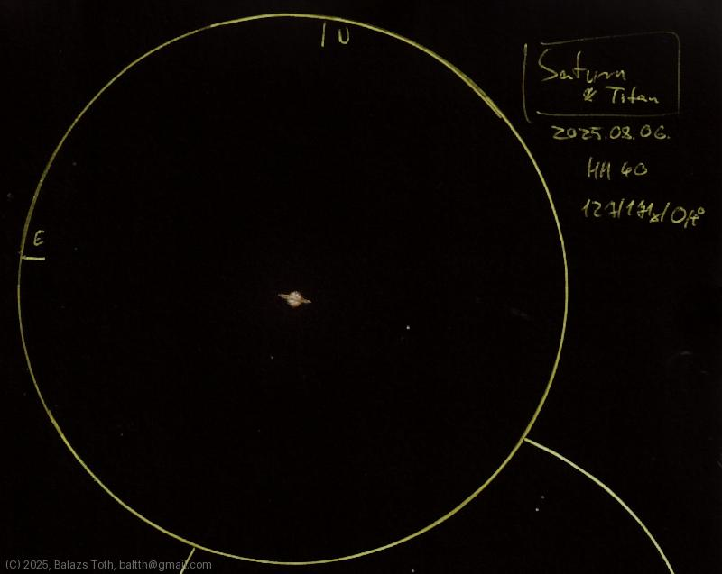

# Saturn

[Main page](../index.md) -- [Index](../pages/obj_index.md) -- [Next: Saturn on 2025-09-11](../obs/saturn-2025-09-11.md)

_Saturn_ -- _Planet in Solar System_  

Saturn and Titan for the first time...
The rings look flat now but still have visible shadow.

It was a challenge to sketch the planet in this small size.
I used no blending, thus the texture is my fault.

Object | Saturn
-|-
Observed at | Dunaharaszti, HU, 2025-08-06
NELM | ~ 4.0
Aperture | 127 mm
Magnification | 171x
FOV | 0.4°

## Links

- [Full sketch](../img/saturn-theta-ser-20250807.jpg)
- [Original sketch](../scan/20250807.jpg)
- [Next: Saturn on 2025-09-11](../obs/saturn-2025-09-11.md)
