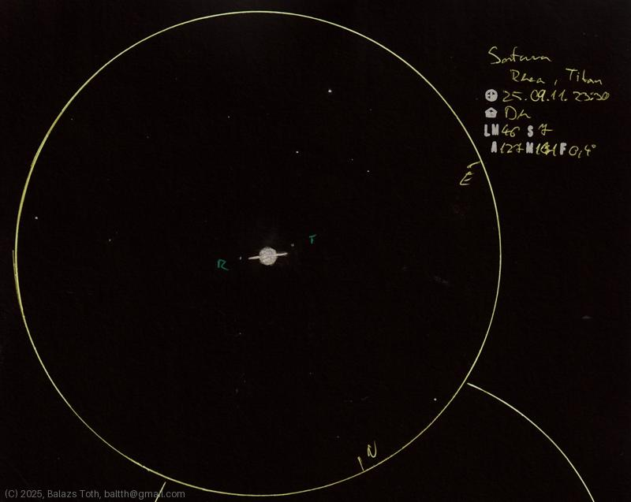

# Saturn

[Main page](../index.md) -- [Index](../pages/obj_index.md) -- [Previous: Saturn on 2025-08-06](../obs/saturn-2025-08-06.md)

_Saturn_ -- _Planet in Solar System_  

Saturn with moons Titan and Rhea, near to BH Piscium.

Color of Saturn is much better than in my previous sketch,
the apparent size also seems better. Now I have to
learn drawing a circle.

Object | Saturn
-|-
Observed at | Dunaharaszti, HU, 2025-09-11 23:30
NELM | ~ 46
Seeing | 7
Aperture | 127 mm
Magnification | 171x
FOV | 0.4°

> This sketch page is incomplete, will be updated later.

## Links

- [Full sketch](../img/saturn-na-20250912.jpg)
- [Original sketch](../scan/20250912080237_001.jpg)
- [Previous: Saturn on 2025-08-06](../obs/saturn-2025-08-06.md)
