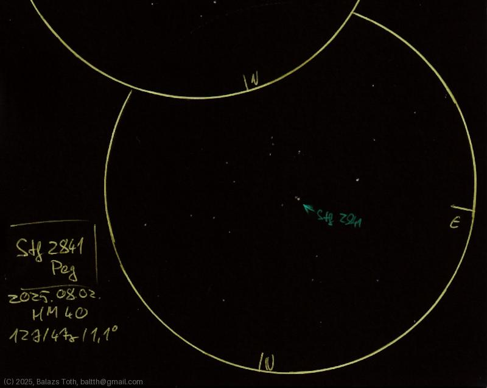

# STF 2841

[Main page](../index.md) - [Index](../pages/obj_index.md)

_Σ 2841_ - _Double star in Pegasus_  

Object | STF 2841
-|-
Observed at | Dunaharaszti, HU, 2025-08-02
NELM | ~ 4.0
Aperture | 127 mm
Magnification | 47x
FOV | 1.1°

## Links

- [Full sketch](../img/1-peg-stf-2841-20250803.jpg)
- [Original sketch](../scan/20250803.jpg)
