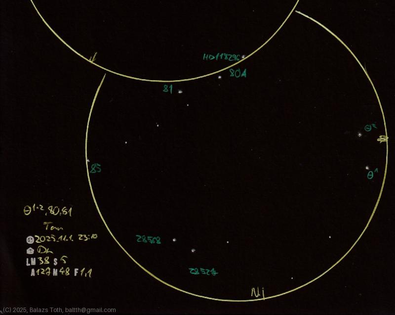

# Theta-1 Tauri, Theta-2 Tauri, 80 Tauri, 81 Tauri

[Main page](../index.md) -- [Index](../pages/obj_index.md)

_Theta-1 Tau_ -- _Star in Taurus_  
_Theta-2 Tau_ -- _HD 28319_ -- _Chamukuy_ -- _Star in Taurus_  
_80 Tau_ -- _STF 554_ -- _HD 28485_ -- _Star in Taurus_  
_81 Tau_ -- _Star in Taurus_  

These stars are part of the Hyades, forming an asterism like a
[Penrose triangle](https://en.wikipedia.org/wiki/Penrose_triangle).
Visually it's more spectacular...

Objects | Theta-1 Tauri, Theta-2 Tauri, 80 Tauri, 81 Tauri
-|-
Observed at | Dunaharaszti, HU, 2025-11-01 23:10
NELM | ~ 3.8
Seeing | 5
Aperture | 127 mm
Magnification | 48x
FOV | 1.1°

#### Object data

Objects | HD 28307 | HD 28319 | HD 28485 | HD 28546
-|-|-|-|-
Desc. | Yellow giant star † | Main sequence giant star † | Main sequence star | Main sequence star
RA | 04h 28m 34s † | 04h 28m 39s † | 04h 30m 08s † | 04h 30m 38s †
Dec | 15° 57' 44" † | 15° 52' 15" † | 15° 38' 16" † | 15° 41' 31" †
Spectral class | G7III † | A7III † | F0V... † | Am †

† fetched from [astronomyapi.com](http://astronomyapi.com)

## Links

- [Full sketch](../img/c-2025-a6-theta-tau-80-tau-81-tau-20251103.jpg)
- [Original sketch](../scan/20251103003438_001.jpg)
