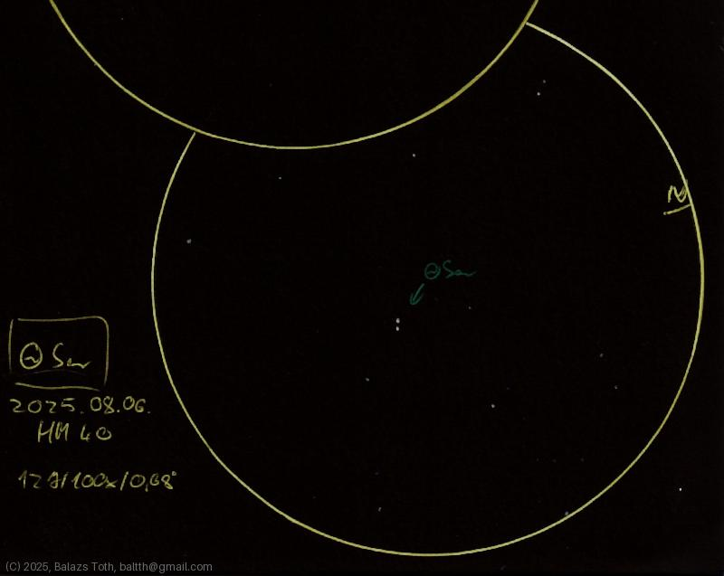

# Theta Serpentis

[Main page](../index.md) -- [Index](../pages/obj_index.md)

_Theta Ser_ -- _θ Ser_ -- _Alya_ -- _Double star in Serpens_  

Object | Theta Serpentis
-|-
Observed at | Dunaharaszti, HU, 2025-08-06
NELM | ~ 4.0
Aperture | 127 mm
Magnification | 100x
FOV | 0.68°

#### Object data

Objects | Theta Ser A | Theta Ser B
-|-|-
Fetched as | HD 175638 | HD 175639
Desc. | Main sequence star | Main sequence star
RA | 18h 56m 13s † | 18h 56m 14s †
Dec | 4° 12' 13" † | 4° 12' 8" †
Magnitude | 4.6 | 5.0
Spectral class | A5V † | A5Vn †

† fetched from [astronomyapi.com](http://astronomyapi.com)

## Links

- [Full sketch](../img/saturn-theta-ser-20250807.jpg)
- [Original sketch](../scan/20250807.jpg)
