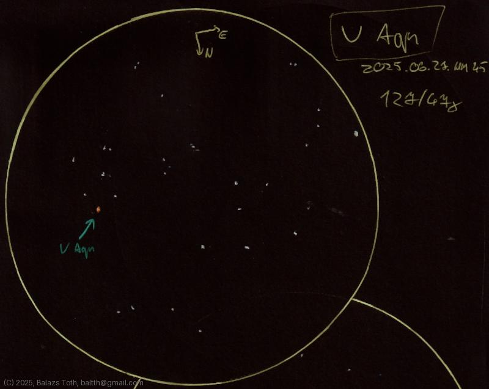

# V Aquilae

[Main page](../index.md) -- [Index](../pages/obj_index.md)

_V Aql_ -- _Carbon star in Aquila_  

Oops, it's a typo, 'V Aqu' is written there. Apart from this,
I really like this star and its neighborhood.

Object | V Aquilae
-|-
Observed at | Dunaharaszti, HU, 2025-06-27
NELM | ~ 4.5
Aperture | 127 mm
Magnification | 47x
FOV | 1.1°

## Links

- [Full sketch](../img/v-aql-wz-cas-20250628.jpg)
- [Original sketch](../scan/20250628_2.jpg)
