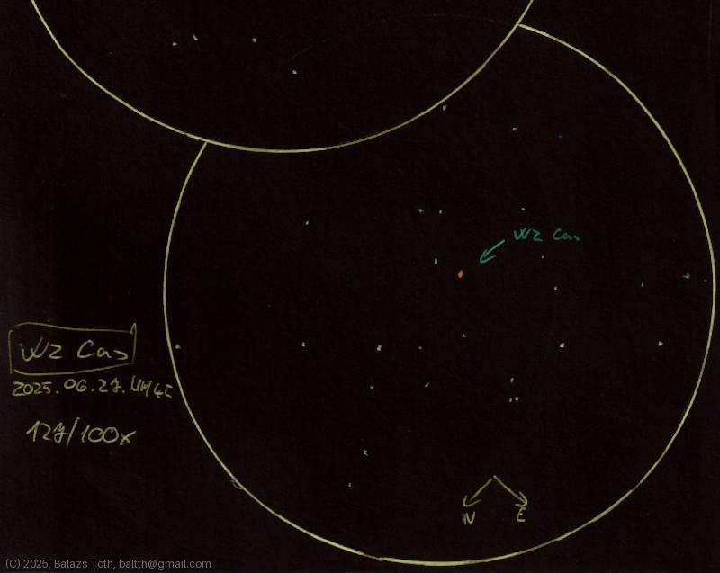

# WZ Cassiopeiae

[Main page](../index.md) - [Index](../pages/obj_index.md)

_WZ Cas_ - _Carbon star in Cassiopeia_  

Object | WZ Cassiopeiae
-|-
Observed at | Dunaharaszti, HU, 2025-06-27
NELM | ~ 4.5
Aperture | 127 mm
Magnification | 100x
FOV | 0.68°

## Links

- [Full sketch](../img/v-aql-wz-cas-20250628.jpg)
- [Original sketch](../scan/20250628_2.jpg)
