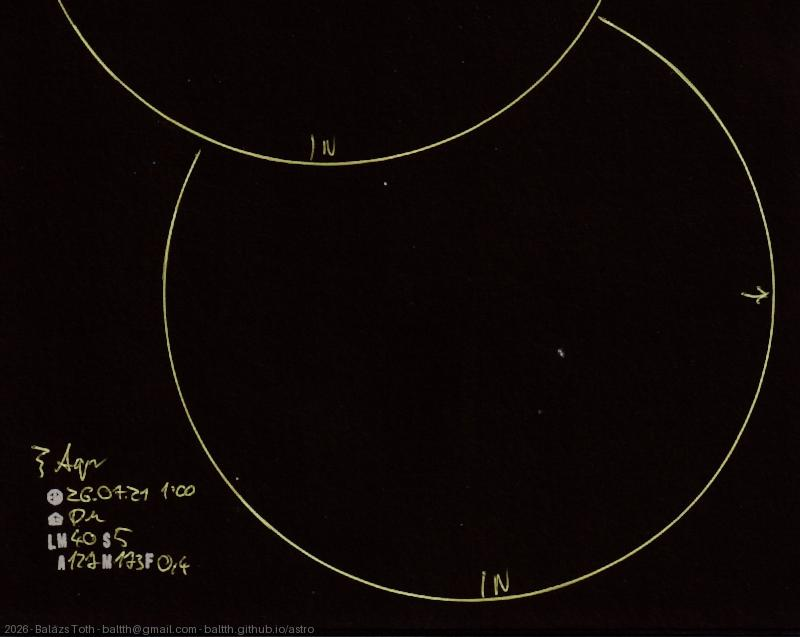

# Zeta Aquarii

[Main page](../index.md) -- [Index](../pages/obj_index.md)

_Zeta Aqr_ -- _ζ Aqr_ -- _Sadaltager_ -- _Triple star system in Aquarius_  

> Most of the object data is from [Wikipedia](https://en.wikipedia.org/wiki/Zeta_Aquarii),
> as _astronomyapi.com_ had totally wrong declination value for B component _(HD 213051)_
> and nothing for A. By the way, the separation value of 2.1" also seems a bit low to me...

Object | Zeta Aquarii
-|-
Observed at | Dunaharaszti, HU, 2026-07-21 01:00
NELM | ~ 4.0
Seeing | 5
Aperture | 127 mm
Magnification | 171x
FOV | 0.4°

#### Object data

Objects | Zeta Aqr A | Zeta Aqr B
-|-|-
Fetched as | HD 213052 | HD 213051
Desc. | Astrometric binary star with a main sequence giant | Main sequence giant star †
RA | 22h 28m 49s | 22h 28m 49s †
Dec | -0° 1' 11.89" | -0° 1' 13.96"
Magnitude | 4.4 | 4.5
Spectral class | F3V | F6IV

† fetched from [astronomyapi.com](http://astronomyapi.com)

## Links

- [Full sketch](../img/m30-zeta-aqr-20260804.jpg)
- [Original sketch](../scan/20260804000314_001.jpg)
