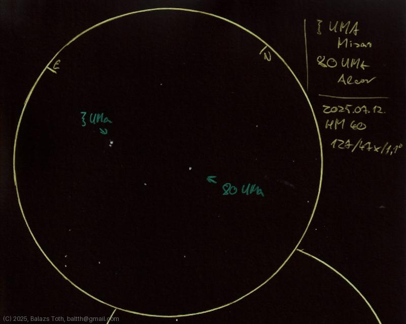

# Zeta Ursae Majoris, 80 Ursae Majoris

[Main page](../index.md) -- [Index](../pages/obj_index.md)

_Zeta UMa_ -- _ζ UMa_ -- _Mizar_ -- _Double star in Ursa Major_  
_80 UMa_ -- _Alcor_ -- _Binary star in Ursa Major_  

Dedicated to my dear wife, Klári.

My ζ 'zeta' looks like a ξ 'xi' here, sorry for that.
I'm sure I'll make another sketch of this trio some day.

Objects | Zeta Ursae Majoris, 80 Ursae Majoris
-|-
Observed at | Dunaharaszti, HU, 2025-07-12
NELM | ~ 4.0
Aperture | 127 mm
Magnification | 47x
FOV | 1.1°

#### Object data

Objects | Zeta-1 Ursae Majoris | Zeta-2 Ursae Majoris | 80 Ursae Majoris
-|-|-|-
Fetched as | HD 116656 | HD 116657 | HD 116842
Desc. | Main sequence main sequence star † | Main sequence star † | Binary of main sequence stars
RA | 13h 23m 55s † | 13h 23m 56s † | 13h 25m 13s †
Dec | 54° 55' 31" † | 54° 55' 14" † | 54° 59' 17" †
Magnitude | 2.23 | 3.88 | 3.99
Spectral class | A2V † | A1 m † | A5V SB + M3-4

† fetched from [astronomyapi.com](http://astronomyapi.com)

## Links

- [Full sketch](../img/zeta-uma-80-uma-kappa-her-20250715.jpg)
- [Original sketch](../scan/20250715_1.jpg)
